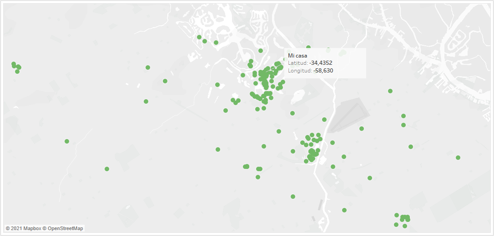

## VISUALIZACIÓN DE LA INFORMACIÓN
**TP: DATOS PERSONALES**

CANTIDAD DE PERSONAS QUÉ SALUDO CADA DÍA, EN UNA SEMANA

[Recolección de datos](data.csv)
##

**Introducción**

La idea del trabajo consiste en poder visualizar a partir de datos recolectados a mano, para cada día de la semana, cuántas personas saludé. Poder escribir en el momento de encuentro con una persona, la fecha de ese día, el lugar y el horario del saludo, además de todos los atributos que le correspondan a ella. Se busca realizar esta acción por un mes, es decir, por 4 semanas seguidas.

###### El trabajo fue comenzado el día lunes 23/08/2021

##
**Los datos elegidos fueron:** 

- Nombre
- edad y rango de edad
- sexo
- color de pelo
- categoría (familiar, conocido, desconocido o amigo)
- latitud y longitud
- semana y día de semana
- fecha y hora

Cada uno de estos datos fue obtenido empíricamente. Cabe destacar que el nombre, la edad, el sexo y el color de pelo son todas características propias de la persona a la qué saludé. Las distintas categorías en las cuales puede estar ubicada una persona pueden ser: familiar, amigo, conocido (en el caso qué yo conozca a esta persona pero no sea parte de mi familia o de mis amistades) y desconocido. Por último, las coordenadas fueron recolectadas mediante Google Maps, utilizando geolocalizadores en el momento de encuentro con alguien, y su respectiva hora de encuentro.

##
**Se quiere mostrar**
un análisis de las características de las personas que son saludadas, como cuántas de ellas son mujeres o cuántas son varones, como son sus edades y a que rango pertenecen, cuál es su color de pelo, o cuántas de estas son consideradas como conocidos o desconocidos, entre otras.

A modo de ejemplo, se podría mencionar un dato sumamente destacable, y este es que al cabo de la primer semana casi un 70 % de las personas que saludé fueron mujeres, siendo así el 30 % restante hombres.

Además, es interesante poder notar en que rango de edad caen las personas que saludo. Si están ubicadas dentro de los menores de 18 años (0-18), o son personas entre los 18 y 25 (mi rango de edad), si son adultos entre los 24 y 40 o mayores a 40 años, o por ejemplo si están dentro del rango de edad mayor 60-80. Este tipo de información puede estar representada en un mapa de árbol, donde se logre visualizar las cantidades para cada categoría de edad a través del tamaño del área y su respectivo color. Así, se puede ver fácilmente como las personas con las que más me relaciono son aquellas que tienen mis mismos años.

Siguiendo con el análisis, es notorio también destacar si dentro de la cantidad registrada, son mayoría aquellas personas que son conocidas, familiares o amigos, o si suelo ser más amigable con aquellas personas que caen en la categoría de desconocidos.

##
Como puede ser visto, se puede llevar un análisis profundo de los datos recolectados, para obtener interesantes conclusiones.

El trabajo final se puede ver en [este link](https://inesmurtagh.github.io/pdata/datospersonales.html)

##

###### Dejo aquí el link a la presentación del día 27/09/2021

###### [Video Entrega](https://drive.google.com/file/d/1RoIciAzBq0pAejQE1QOFCt5DxIMll2T_/view?usp=sharing)

